# Introduction to computational text analysis for the DIA (DA Vienna)

This GitHub repository accompanies the DIA course "Introduction to computational text analysis" taught by Hauke Licht (hauke.licht@uibk.ac.at, University of Innsbruck) at the DA Vienna.

Participants must **complete the basic computer setup below during Block 1**.<!--and **install and check the neural packages before Block 2**.-->
These instructions assume no previous experience with a terminal.
<!-- Try the neural installation in advance and email **hauke.licht@uibk.ac.at** if you encounter installation issues, so we can arrange a working setup before Block 2. -->

## Computer setup

> [!TIP]
> **Want an AI assistant to help with setup?** This repository includes [AGENTS.md](AGENTS.md), a guide for assistants supporting students. Copy the prompt below into your coding assistant or AI chat:
>
> "Help me complete the computer setup for the DIA text analysis course. First read AGENTS.md in the root of the course repository and README.md, then follow the setup guidance in those files. I have little experience with terminals. Ask which operating system and processor I have and what I have already installed. Walk me through one step at a time and check the result before continuing. Help me complete the basic setup."
>
> If you have already cloned the repository, open its folder in your coding assistant. If you are using a chat assistant that cannot access the files, attach **AGENTS.md** and **README.md**, or paste their contents into the chat. You can obtain both from [the course repository on GitHub](https://github.com/haukelicht/dia_text_analysis) before installing anything. Confirm that the assistant can read them before following its instructions.

<!-- Installation instructions and compatibility were checked on **6 October 2026**, using the official documentation linked below and this project's `uv.lock`. -->

You will install

- **uv** (to manage Python and packages), - **Git** (to download and update the course materials from GitHub),
- **Visual Studio (VS) Code** (to edit and run code),
**VS Code extensions** (for Python, notebooks, and displaying callout boxes),
- **Python 3.13** (the programming language used in this course).

You need **internet access** and **free disk space**.

<!-- Allow several GB for the neural packages required from Block 2; that installation includes PyTorch and can take a while. -->

There are two Python setups:

1. **basic** for Python basics (Block 1) and API-based LLM exercises (Block 3)
2. **neural** for sentence embeddings, BERTopic/UMAP (Block 2), and transformer training (Block 3).

Both are defined in [pyproject.toml](pyproject.toml) and installed from [uv.lock](uv.lock).
For Block 1, the basic setup is sufficient.


### _Before you start:_ check your computer

#### Windows

Open **Settings > System > About** and check **System type**.

Identify your computer type and operating system version to determine the appropriate setup:

| Computer | Basic setup (Block 1) | Neural setup (required from Block 2) |
| --- | --- | --- |
| Windows on a 64-bit Intel or AMD processor (x64) | Follow the instructions below. | Available with `--extra neural`. |
| Windows on an ARM processor (e.g., Snapdragon) | Follow the instructions below using native ARM64 Python 3.13. | Current PyTorch lacks a compatible package. |


_Note:_ The package compatibility assessment is based on locked wheel files, not installation tests on every computer; see [dependency compatibility notes](docs/setup-dependencies.md).


#### Apple (macOS)

Open **Apple menu > About This Mac** and check **Chip/Processor** and the macOS version.

Identify your computer type and operating system version to determine the appropriate setup:

| Computer | Basic setup (Block 1) | Neural setup (required from Block 2) |
| --- | --- | --- |
| Apple silicon Mac (M1, M2, M3, etc.) with **macOS 14 Sonoma or newer** | Follow the instructions below. | Available with `--extra neural`; this includes the M1 Pro. |
| Apple silicon Mac with **macOS 13 Ventura** | Follow the instructions below. | Requires macOS 14 or newer with the current locked versions. |
| Intel Mac with **macOS 13 Ventura or newer** | Follow the instructions below. An OS-specific dependency pin supplies the needed Jupyter wheel. | Current PyTorch and other neural dependencies lack compatible packages. |

<!-- For older operating systems, contact the instructor to check software compatibility. -->

_Note:_ The package compatibility assessment is based on locked wheel files, not installation tests on every computer; see [dependency compatibility notes](docs/setup-dependencies.md).


<!-- **You do not need to install Python or Anaconda separately.** We use Python **3.13**, as specified in [.python-version](.python-version). If you already have another Python installation, leave it installed; we will select the course's own environment later. -->

### Step 1: Install uv

We will use the terminal for installation. A **terminal** is a window where you give the computer written instructions called **commands**.

You only need to copy the code shown below, paste it into the terminal, and press **Enter**. Wait until a command finishes and a new prompt appears before entering the next one. Prompts such as `PS C:\Users\...>` or `%` are displayed by the computer; do not type them.

#### Windows

1. Open the **Start menu**, search for **Windows PowerShell**, and open it normally.
2. Paste the following command and press **Enter**:

   ```powershell
   powershell -ExecutionPolicy ByPass -c "irm https://astral.sh/uv/install.ps1 | iex"
   ```

   This downloads and runs Astral's official installer. The execution-policy exception applies to that PowerShell process; you do not need to change the computer's policy permanently.
3. When installation finishes, **close** PowerShell and open it again. If VS Code was open, close and reopen it too so it can find the new command.
4. Check the installation:

   ```powershell
   uv --version
   ```

#### macOS

1. Press **Command + Space**, type **Terminal.app**, and press **Return** to open the Terminal application.
2. Paste the following command and press **Return**:

   ```sh
   curl -LsSf https://astral.sh/uv/install.sh | sh
   ```

3. When installation finishes, quit Terminal and open it again. If VS Code was open, quit and reopen it too.
4. Check the installation:

   ```sh
   uv --version
   ```

Both checks should print `uv` followed by a version number. If the command cannot be found, see [Troubleshooting](#troubleshooting).

Example on macOS (your version number may differ):

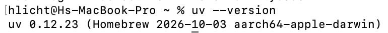

**_Source:_** [Astral's official uv installation guide](https://docs.astral.sh/uv/getting-started/installation/). The standalone installer does not require Python or Rust.

### Step 2: Install Git

**Git is required:** you will clone the course repository once and pull updates from GitHub throughout the course. A **clone** is a local copy that Git can update.<!--; a ZIP download cannot be updated with `git pull`.-->

#### Windows

1. Open the [official Git for Windows download page](https://git-scm.com/install/windows).
2. Under **Standalone Installer**, choose **x64 Setup** for an Intel/AMD computer or **ARM64 Setup** for a Snapdragon/ARM computer.
3. Open the downloaded `.exe` and follow the installer. Keep the option that makes Git available **from the command line and third-party software** enabled; the other defaults are sufficient for this course.
4. Close and reopen PowerShell and VS Code, then run:

   ```powershell
   git --version
   ```

#### macOS

1. In Terminal, check whether Git is already available:

   ```sh
   git --version
   ```

2. If macOS offers to install **Command Line Developer Tools**, accept and wait for installation. If Git is unavailable and no prompt appears, run:

   ```sh
   xcode-select --install
   ```

   Follow the installation dialog. These Apple tools include Git; you do not need the full Xcode application.
3. Reopen Terminal and VS Code, then run `git --version` again.

Both systems should print `git version` followed by a version number.

Example on macOS (your version number may differ):

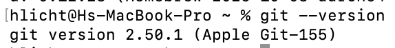

Sources: [Git's Windows installation guide](https://git-scm.com/install/windows) and [macOS installation guide](https://git-scm.com/install/mac).

### Step 3: Download and install VS Code

Download the **desktop application** from the [official VS Code download page](https://code.visualstudio.com/download).

#### Windows

1. Choose the Windows **User Installer** for **x64** if your computer has an Intel or AMD processor. For an ARM computer, choose **Arm64** for the editor.
2. Open the downloaded `.exe` file and follow the installer. The User Installer normally does not need administrator permissions.
3. Keep **Add to PATH** enabled if offered. Finish installation and open **Visual Studio Code** from the Start menu.

**_Source:_** [Microsoft's Windows installation instructions](https://code.visualstudio.com/docs/setup/windows).

#### macOS

1. Choose **Apple silicon** for an M-series Mac, or **Intel chip** for an Intel Mac. The **Universal** download works on both.
2. Open the downloaded `.dmg` and drag **Visual Studio Code.app** into **Applications**. If you downloaded a ZIP instead, double-click it to extract the application and move the application into **Applications**.
3. Open **Visual Studio Code** from Applications.

**_Source:_** [Microsoft's macOS installation instructions](https://code.visualstudio.com/docs/setup/mac).

### Step 4: Install the VS Code extensions

1. Click the **Extensions** icon in VS Code's left sidebar (four small squares). Alternatively, press **Ctrl + Shift + X** on Windows or **Command + Shift + X** on macOS.
2. Search for each extension below, check its publisher, and click **Install**. Searching by the exact extension ID helps avoid similarly named extensions.
3. If an extension is already installed, leave it installed. Click **Reload** if requested.

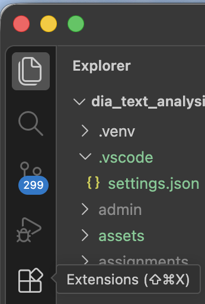

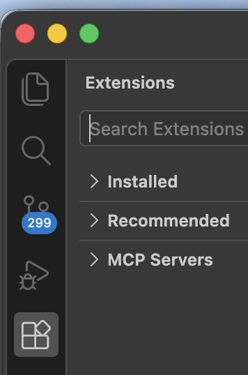

| Extension | Publisher / exact ID | Purpose |
| --- | --- | --- |
| [Python](https://marketplace.visualstudio.com/items?itemName=ms-python.python) | Microsoft / `ms-python.python` | Python editing, running code, and debugging. |
| [Python Environments](https://marketplace.visualstudio.com/items?itemName=ms-python.vscode-python-envs) | Microsoft / `ms-python.vscode-python-envs` | Find and select the course's Python environment. |
| [Jupyter](https://marketplace.visualstudio.com/items?itemName=ms-toolsai.jupyter) | Microsoft / `ms-toolsai.jupyter` | Open and run `.ipynb` notebooks. |
| [Quarto](https://marketplace.visualstudio.com/items?itemName=quarto.quarto) | Quarto / `quarto.quarto` | Nicely display callout boxes (notes, tips, and warnings) in the course materials. This is its purpose in our course setup. |
| [Pylance](https://marketplace.visualstudio.com/items?itemName=ms-python.vscode-pylance) (recommended) | Microsoft / `ms-python.vscode-pylance` | Code completion and help finding mistakes. Usually installed with Python. |

An extension adds features to VS Code; it does **not** install the course's Python packages. We do that in step 6. Use Python Environments to **select** the environment created there, rather than creating a second one.

<details>
<summary>See the extension names and publishers</summary>

These examples show extensions already installed, so they have a gear icon. On your first installation, click **Install**.

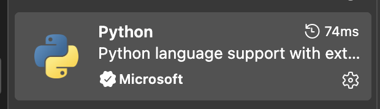

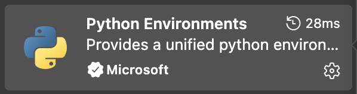

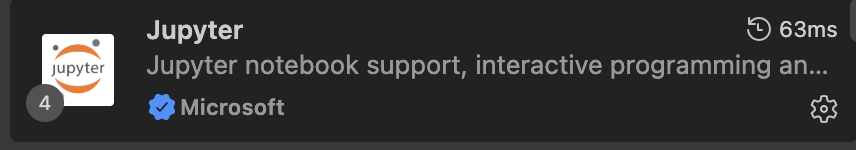

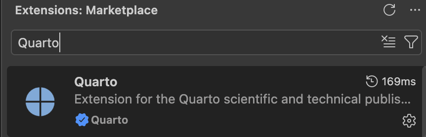

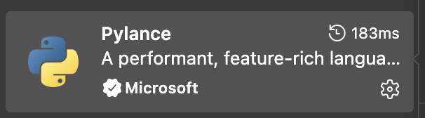

</details>

### Step 5: Clone and open the course repository

Use Git to get the course materials from [the course repository on GitHub](https://github.com/haukelicht/dia_text_analysis). You do not need a GitHub account to clone or pull from this public repository.

1. Open VS Code's **Command Palette**: **Ctrl + Shift + P** on Windows or **Command + Shift + P** on macOS.
2. Type **Git: Clone** and select that command.
3. Paste `https://github.com/haukelicht/dia_text_analysis.git` and press **Enter**.
4. Choose a parent folder you can find again, such as **Documents**. Git creates a `dia_text_analysis` folder inside it. Wait for cloning to finish.
5. Click **Open** when VS Code offers to open the cloned repository. If asked whether you trust the authors, confirm after checking that this is the course repository.
6. In the file list on the left, check that you can see **README.md**, **pyproject.toml**, **uv.lock**, and **notebooks**. This folder is the **project root**. To reopen it later, use **File > Open Folder…** (or **File > Open…** on macOS) and select `dia_text_analysis`.

If you previously downloaded a ZIP, keep your work in that old folder and clone a fresh copy using these steps. Use the cloned folder for the remaining setup.

<details>
<summary>Finding the repository URL on GitHub</summary>

The green **Code** button opens this menu. **Select HTTPS** if you copy the URL from GitHub; the screenshot below shows the SSH tab, which requires additional SSH-key setup. For this course, use the HTTPS URL written in step 3 above.

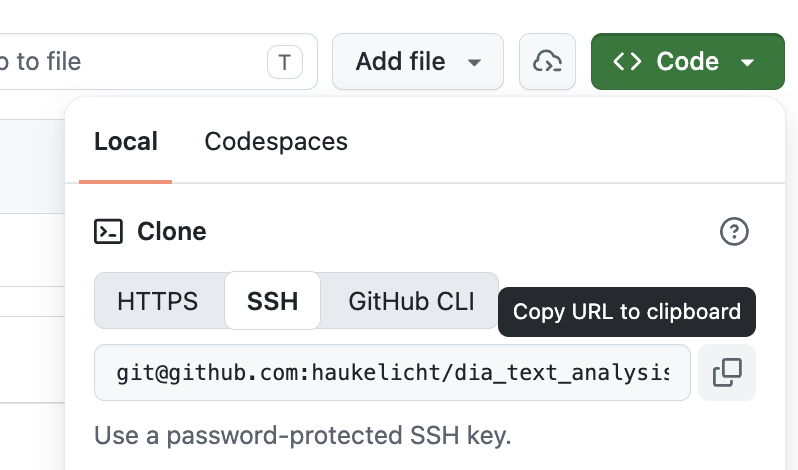

</details>

**_Source:_** [VS Code's instructions for cloning repositories](https://code.visualstudio.com/docs/sourcecontrol/repos-remotes#_clone-repositories).

### Step 6: Install Python and the locked course packages

1. With the course folder open in VS Code, choose **Terminal > New Terminal** from the top menu. A command window opens at the bottom. It should start in the project root.
2. On **Windows**, use a **PowerShell** terminal. If it is labelled Command Prompt or something else, use the arrow next to the terminal's **+** button and choose **PowerShell**. On **macOS**, the default terminal (usually `zsh`) is fine.
3. Check that you are in the right folder:

   ```sh
   ls
   ```

   This lists the current folder's files on both systems. You should see `pyproject.toml` and `uv.lock`. If you do not, reopen the correct folder in VS Code and create a new terminal.
4. Run these commands **one at a time**. They are the same on Windows and macOS:

   ```sh
   uv python install 3.13
   ```

   ```sh
   uv sync --locked --no-install-project
   ```

Opening a terminal in VS Code on macOS:

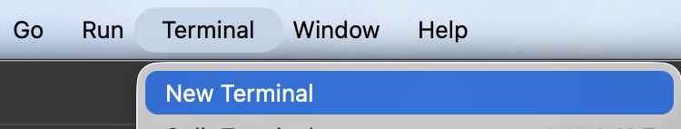

The integrated terminal appears at the bottom. Type commands at the cursor after the prompt; your computer name and prompt may differ. The `(dia-text-analysis)` prefix in this example is not something you need to type.

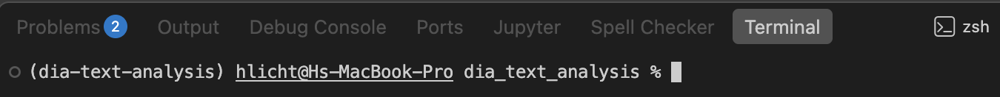

The first installs Python 3.13. The second creates **`.venv`**, a folder containing this project's Python environment, and installs the versions recorded in **`uv.lock`**, including Jupyter and its Python kernel. The basic setup excludes the neural packages, which you add before Block 2. `--locked` makes uv stop if `pyproject.toml` and the lockfile disagree, instead of changing the lockfile. Wait for installation to finish without an error before continuing.

> [!IMPORTANT]
> Keep **`--no-install-project`** in the sync command. The repository currently declares a course package without its source module. This flag installs the locked dependencies while skipping that nonexistent package. It prevents the error **Expected a Python module at: src/dia_text_analysis/__init__.py**. You do not need to create a `src` folder.

**Use `uv sync --locked --no-install-project` for this course, rather than installing `requirements.txt` or individual packages.** The lockfile also specifies versions of packages that our packages depend on. Do not edit it or run `uv lock` to fix a setup error; contact the instructor.

You do not need to activate `.venv` manually. After a successful sync, commands prefixed with **`uv run --no-sync`** use the installed course environment without attempting to build the nonexistent course package again. Run the appropriate sync command after pulling updates or whenever you need to install packages; `--no-sync` does not update them. For example:

```sh
uv run --no-sync python --version
```

This should print **Python 3.13.x**.

<!-- #### Required before Block 2: install the neural packages

**The neural packages are required from Block 2 onwards.** Try installing them before Block 2, allowing time to resolve any problems. In the same project terminal, run:

```sh
uv sync --locked --no-install-project --extra neural
```

This adds the neural packages to the **same `.venv`**; you do not need a second environment. Use this setup on Windows x64 or Apple silicon macOS 14+, including an M1 Pro. Some API-based LLM notebooks also contain optional sentence-embedding examples that require this extra.

Then run the neural import check in step 8. **If installation or the check fails, email hauke.licht@uibk.ac.at before Block 2.** Include your operating system and version, processor type, the command you ran, and the complete error message. Try the installation even if the compatibility table lists a limitation for your computer, and report the result so we can arrange an alternative setup. Do not install compilers or change dependency versions to work around an error.

After syncing with `--extra neural`, use `uv run --no-sync` to run neural scripts in that installed environment. If you separately installed the Quarto application, you can also check its Jupyter setup with:

```sh
uv run --no-sync quarto check jupyter
```

After installing the extra, keep using `uv sync --locked --no-install-project --extra neural` when synchronising the full environment. **Running `uv sync --locked --no-install-project` without the extra returns to the basic setup and removes neural-only packages.** Restart a notebook's kernel after changing its installed packages.

**_Sources:_** [Installing Python with uv](https://docs.astral.sh/uv/guides/install-python/), [locking and syncing](https://docs.astral.sh/uv/concepts/projects/sync/), and [running project commands](https://docs.astral.sh/uv/concepts/projects/run/). -->

### Step 7: Tell VS Code which Python to use

The **interpreter** is the Python program that runs your code. Select the one inside this project's `.venv`:

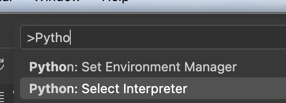

1. Open the Command Palette using **Ctrl + Shift + P** (Windows) or **Command + Shift + P** (macOS).
2. Type **Python: Select Interpreter** and select that command.
3. Choose the **Python 3.13** entry whose path contains this course folder and **`.venv`**.
4. If it is missing, choose **Enter interpreter path… > Find…** and select:
   - **Windows:** `.venv\Scripts\python.exe` inside the course folder;
   - **macOS:** `.venv/bin/python` inside the course folder. In the file picker, press **Command + Shift + .** to show hidden folders if needed.

If VS Code shows a path belonging to another computer (for example, one beginning `/Users/hlicht/`), replace that selection with your own `.venv` using these steps.

Choose the course environment with **Python 3.13** and **`.venv`** in its path:

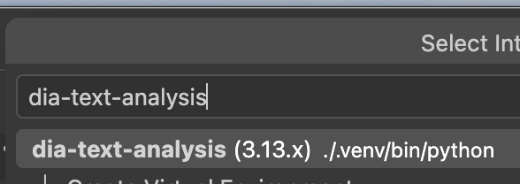

##### _During the course_

For **each Jupyter notebook** (`.ipynb`), also click **Select Kernel** at the top right, then **Python Environments**, and choose the same `.venv` Python. If you see an existing kernel name, click it to change it; you may need **Select Another Kernel…** first. Notebook kernel selection is separate from interpreter selection for `.py` files.

**_Sources:_** [Python interpreter selection](https://code.visualstudio.com/docs/languages/python/), [Python Environments](https://code.visualstudio.com/docs/python/environments), and [Jupyter notebooks in VS Code](https://code.visualstudio.com/docs/datascience/jupyter-notebooks).

### Step 8: Check that you are ready

In the VS Code terminal, run:

```sh
uv run --no-sync python -c "import sys, numpy, pandas, sklearn, ipykernel; print(sys.executable); print('Course environment OK')"
```

The path should end in `.venv\Scripts\python.exe` (Windows) or `.venv/bin/python` (macOS), followed by **Course environment OK**. This checks several core packages; it does not download models or test every exercise.

<!-- **Before Block 2**, after installing the neural extra, also run:

```sh
uv run --no-sync python -c "import torch, transformers, sentence_transformers, bertopic, umap, hdbscan; print('Neural environment OK')"
```

This should print **Neural environment OK**. It checks imports without downloading a model or running GPU training. -->

Open a course notebook, select its `.venv` kernel, and run a code cell using the triangle next to it. To check the notebook's Python, add and run a temporary code cell:

```python
import sys
print(sys.executable)
```

It should show the same `.venv` path.

<!-- If you installed the Quarto application and want to render documents, prefix its terminal commands with `uv run --no-sync` so it can find the course's Python and Jupyter, for example:

```sh
uv run --no-sync quarto check jupyter
```

If Quarto reports another Python installation, see the [official Python selection instructions](https://quarto.org/docs/computations/python.html). The `QUARTO_PYTHON` setting can point Quarto explicitly to your `.venv` Python. -->

### Keep the course materials up to date

**Before each course block and whenever the instructor announces new materials**, open the cloned `dia_text_analysis` folder in VS Code, save your work, and choose **Terminal > New Terminal**. Run:

```sh
git pull --ff-only
```

This downloads and applies updates from GitHub. **Already up to date** means you have the latest files. Run this inside the course folder; you only clone once.

**Important:** 
If you have local changes that you do not want to lose, make sure to save them with a different filename before running `git pull`.
The easiest way to avoid losing changes is to save a copy of the edited file with your name appended to the filename (e.g., `README.md` → `README_joe.md`).

Should you get a message that local changes would be overwritten, it means you have unsaved edits in the course folder. Save your changes with a different filename and restore the given files, e.g.,

```sh
mv README.md README_joe.md
git checkout -- README.md
git pull --ff-only
```

After a successful pull, update the Python packages to match the new lockfile. During Block 1, run:

```sh
uv sync --locked --no-install-project
```

<!-- **From Block 2 onwards**, use:

```sh
uv sync --locked --no-install-project --extra neural
``` -->

Restart any running notebook kernels after syncing. Keep copies of your completed exercises in a separate folder so you retain your work when course notebooks change. If Git says local changes would be overwritten, or that it cannot fast-forward, stop and email the instructor with the message. Keep your edited files; do not discard changes to make the pull succeed.

**_Source:_** [Git's documentation for `git pull` and `--ff-only`](https://git-scm.com/docs/git-pull).

For questions about Rust, C++, CUDA, Windows runtime libraries, or model downloads, see [additional software requirements](docs/additional-software.md).

<details>
<summary>Additional screenshot references</summary>

- [Explorer sidebar icon](assets/setup/vscode-explorer-sidebar-button.png) — opens the course file list.
- [Search sidebar icon](assets/setup/vscode-search-sidebar-button.png) — searches file contents; use the Extensions search field when installing extensions.
- [Alternative macOS terminal with bash](assets/setup/macos-vscode-terminal-bash.png) — its prompt differs from the zsh example above.
- [All setup screenshots and original capture times](assets/setup/README.md).

</details>

### Troubleshooting

| What you see | What to do |
| --- | --- |
| `uv`, `git`, or `quarto` is not recognised / command not found | Complete the relevant installation step, then close and reopen the terminal and VS Code. If needed, restart the computer. If it still fails, save the installer output and contact the instructor. |
| `Failed to build dia-text-analysis` / `Expected a Python module at: src/dia_text_analysis/__init__.py` | Run `uv sync --locked --no-install-project` (add `--extra neural` for Block 2). After a successful sync, use `uv run --no-sync` for terminal commands. Do not create a source module or edit the lockfile. |
| No `pyproject.toml` found | Open the folder containing `README.md`, `pyproject.toml`, and `uv.lock` in VS Code, then create a new terminal. |
| The lockfile needs updating | Pull the latest course files from GitHub and retry the sync command. If it still fails, send the error to the instructor; keep `--locked` in the command. |
| No compatible wheel/distribution, or a request for Rust, CMake, or C++ build tools | Check your processor, macOS version, and that Python is 3.13. See the compatibility table above and contact the instructor before installing build tools. |
| Windows says `Activate.ps1` cannot run because scripts are disabled | You can use `uv sync --locked --no-install-project` and `uv run --no-sync` without activation. Select `.venv` in VS Code; no permanent execution-policy change is needed for this workflow. |
| A notebook says `ModuleNotFoundError` or asks you to install `ipykernel` | Finish `uv sync --locked --no-install-project` (or add `--extra neural` for a neural notebook), then select the notebook's `.venv` kernel. Restart the kernel after changing packages or switching environments. |
| Installation fails on a university-managed computer or a download is blocked | Send the full error to the instructor; institutional restrictions may require IT support. |

For help, email **hauke.licht@uibk.ac.at** or [open an issue in this course repository](https://github.com/haukelicht/dia_text_analysis/issues). Include your operating system, processor type, the command you ran, and the complete error message. Do not include passwords or API keys.
